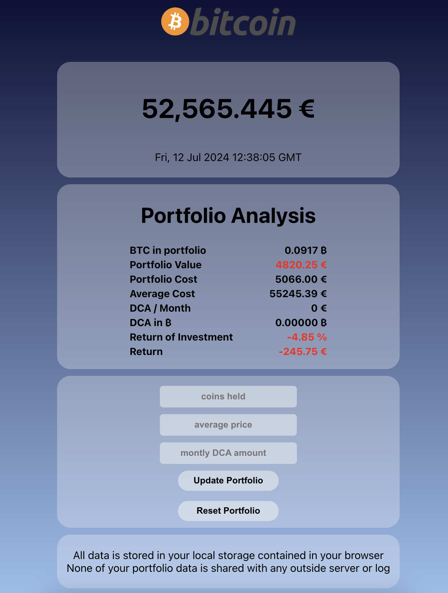
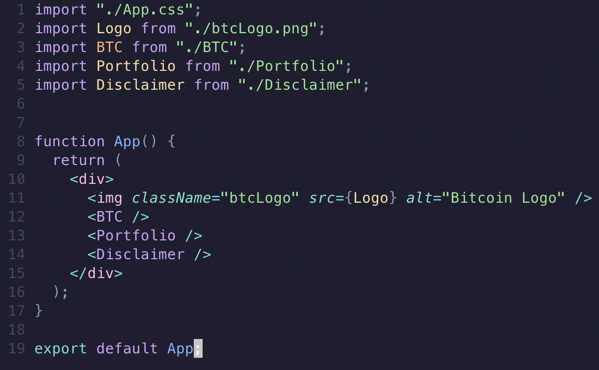
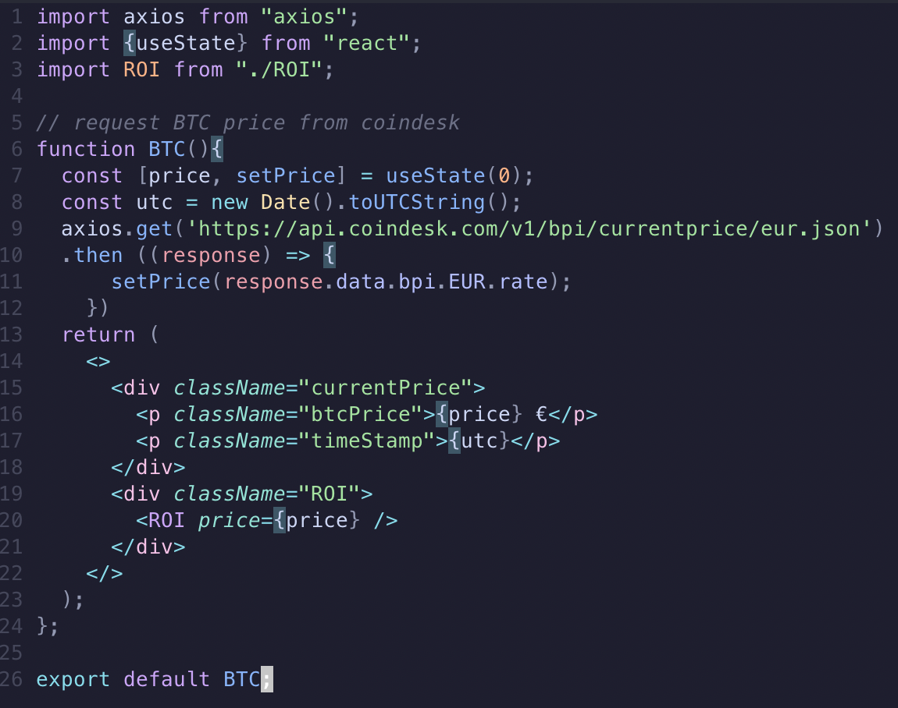
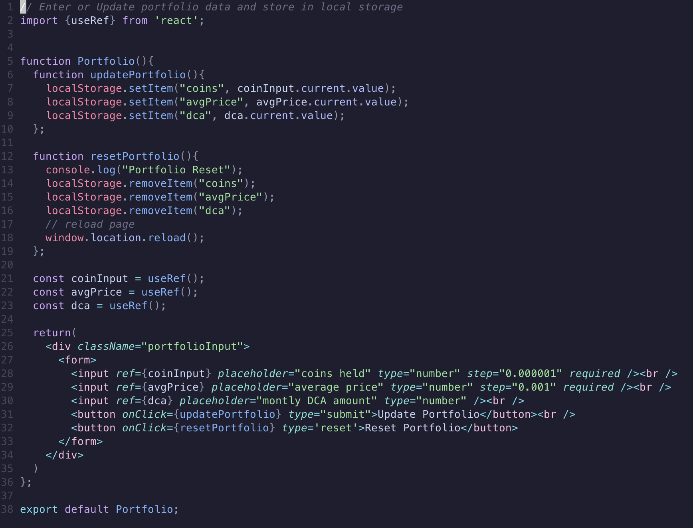
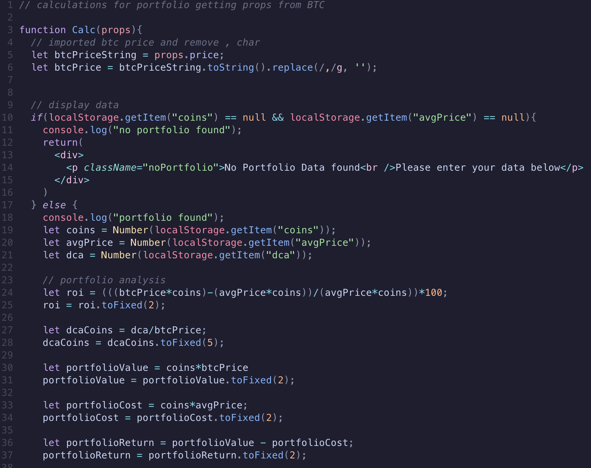
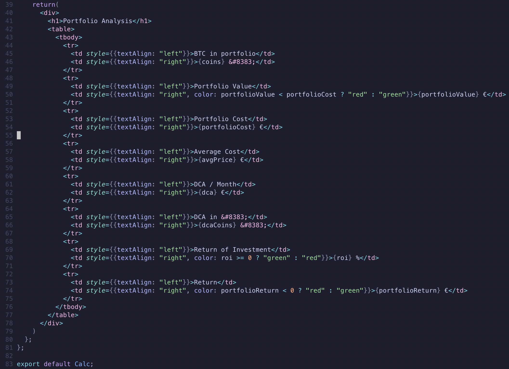

# Simple BTC Portfolio Viewer

## Description
You enter how much &#8383; you own, what the average cost of all your &#8383; was and, only if you want to, how much your are DCAing each month.

Then you get an overview of your portfolio and some nice stats to keep your HODL motivation up.

## Development Notes
Please bear in mind that this is my very first project in react. I previously created a <a href="https://github.com/JetDev22/BTC-Tracker">dashboard out of a 64x64 LED Matrix and a Raspberry Pi Zero</a> with the same data. So it made a great project to kick things off with react.

The BTC.js component gets the current &#8383; price in Euro from coindesk. This price is then passed to the ROI.js component, that takes the price and does all calculations on the portfolio data the user entered.
The Portfolio data is given by the user is collected via a form in the Portfolio.js component and the input is saved to the browser local storage. This way the user retains all entered data and if he chooses the open the page later on, all data is already present from local storage.

<h1>App.js</h1>
<h1>BTC.js</h1>
<h1>Portfolio.js</h1>
<h1>ROI.js Calculations</h1>
<h1>ROI.js JSX Return</h1>

The Update Portfolio button will send all entered data to the localStorage and the Reset Portfolio will delete all items that have been saved to localStorage.

## Docker Image
The docker image is based on node:22-alpine to be easily deployed to your Raspberry Pi or your favorite docker system. 
You can find the image -> <a href="https://hub.docker.com/r/jetdev24/btc-portfolio"> HERE

## ToDo
- Toggle Switch to switch between € and $
